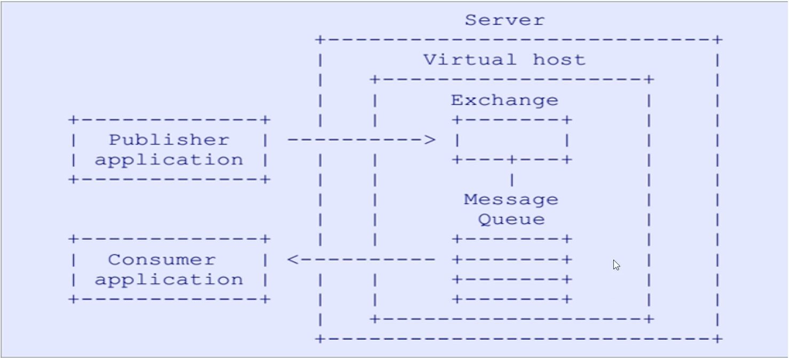

[TOC]

------

### RabbitMQ 特点

RabbitMQ 相较于其他消息队列，有一系列防止消息丢失的措施，拥有强悍的高可用性能，它的吞吐量可能没有其他消息队列大，但是其消息的保障性出类拔萃，被广泛用于金融类业务。与其他消息队列的比较以及强大的防止消息丢失的能力我们将在后续文章再做介绍。

### AMQP 协议

AMQP: Advanced Message Queuing Protocol 高级消息队列协议

AMQP定义:是具有现代特征的二进制协议。是一个提供统一消息服务的应用层标准高级消息队列协议，是应用层协议的一个开放标准，为面向消息的中间件设计。

Erlang语言最初在于交换机领域的架构模式，这样使得RabbitMQ在Broker之间进行数据交互的性能是非常优秀的
Erlang的优点: Erlang有着和原生Socket一样的延迟。

RabbitMQ是一个开源的消息代理和队列服务器，用来通过普通协议在完全不同的应用之间共享数据, RabbitMQ是使用Erlang语言来编写的，并且RabbitMQ是基于AMQP协议的。

###RabbitMQ 消息传递机制

生产者发送消息到指定的 Exchange，Exchange 依据自身的类型(direct、topic等)，根据 routing key 将消息发送给 0 - n 个 队列，队列再将消息转发给了消费者。



**Server:** 又称Broker, 接受客户端的连接，实现AMQP实体服务，这里指`RabbitMQ 服务器`

**Connection:** 连接，应用程序与Broker的网络连接。

**Channel: **网络信道，几乎所有的操作都在 Channel 中进行，Channel是进行消息读写的通道。客户端可建立多个Channel:，每个Channel代表一个会话任务。

**Virtual host: **虚似地址，用于迸行逻辑隔离，是最上层的消息路由。一个 Virtual Host 里面可以有若干个 Exchange和 Queue ，同一个 VirtualHost 里面不能有相同名称的 Exchange 或 Queue。权限控制的最小粒度是Virtual Host。

**Binding:**  Exchange 和 Queue 之间的虚拟连接，binding 中可以包含 routing key。

**Routing key:** 一 个路由规则，虚拟机可用它来确定如何路由一个特定消息，即交换机绑定到 Queue 的键。

**Queue:** 也称为Message Queue,消息队列，保存消息并将它们转发给消费者。

###Message 

消息，服务器和应用程序之间传送的数据，由 Properties 和 Body 组成。Properties 可以对消息进行修饰，比如消息的优先级、延迟等高级特性;，Body 则就 是消息体内容。

properties 中我们可以设置消息过期时间以及是否持久化等，也可以传入自定义的map属性，这些在消费端也都可以获取到。

**生产者**
```java
import com.rabbitmq.client.AMQP;
import com.rabbitmq.client.Channel;
import com.rabbitmq.client.Connection;
import com.rabbitmq.client.ConnectionFactory;
import java.util.HashMap;
import java.util.Map;

public class MessageProducer {
    public static void main(String[] args) throws Exception {
        //1. 创建一个 ConnectionFactory 并进行设置
        ConnectionFactory factory = new ConnectionFactory();
        factory.setHost("localhost");
        factory.setVirtualHost("/");
        factory.setUsername("guest");
        factory.setPassword("guest");

        //2. 通过连接工厂来创建连接
        Connection connection = factory.newConnection();

        //3. 通过 Connection 来创建 Channel
        Channel channel = connection.createChannel();

        //4. 声明 使用默认交换机 以队列名作为 routing key
        String queueName = "msg_queue";

        /**
         * deliverMode 设置为 2 的时候代表持久化消息
         * expiration 意思是设置消息的有效期，超过10秒没有被消费者接收后会被自动删除
         * headers 自定义的一些属性
         * */
        //5. 发送
        Map<String, Object> headers = new HashMap<String, Object>();
        headers.put("myhead1", "111");
        headers.put("myhead2", "222");

        AMQP.BasicProperties properties = new AMQP.BasicProperties().builder()
                .deliveryMode(2)
                .contentEncoding("UTF-8")
                .expiration("100000")
                .headers(headers)
                .build();
        String msg = "test message";
        channel.basicPublish("", queueName, properties, msg.getBytes());
        System.out.println("Send message : " + msg);

        //6. 关闭连接
        channel.close();
        connection.close();

    }
}

```
**消费者**
```java
import com.rabbitmq.client.*;
import java.io.IOException;
import java.util.Map;

public class MessageConsumer {
    public static void main(String[] args) throws Exception{
        //1. 创建一个 ConnectionFactory 并进行设置
        ConnectionFactory factory = new ConnectionFactory();
        factory.setHost("localhost");
        factory.setVirtualHost("/");
        factory.setUsername("guest");
        factory.setPassword("guest");
        factory.setAutomaticRecoveryEnabled(true);
        factory.setNetworkRecoveryInterval(3000);

        //2. 通过连接工厂来创建连接
        Connection connection = factory.newConnection();

        //3. 通过 Connection 来创建 Channel
        Channel channel = connection.createChannel();

        //4. 声明
        String queueName = "msg_queue";
        channel.queueDeclare(queueName, false, false, false, null);

        //5. 创建消费者并接收消息
        Consumer consumer = new DefaultConsumer(channel) {
            @Override
            public void handleDelivery(String consumerTag, Envelope envelope,
                                       AMQP.BasicProperties properties, byte[] body)
                    throws IOException {
                String message = new String(body, "UTF-8");
                Map<String, Object> headers = properties.getHeaders();
                System.out.println("head: " + headers.get("myhead1"));
                System.out.println(" [x] Received '" + message + "'");
                System.out.println("expiration : "+ properties.getExpiration());
            }
        };

        //6. 设置 Channel 消费者绑定队列
        channel.basicConsume(queueName, true, consumer);
    }
}

```

```
Send message : test message

head: 111
 [x] Received 'test message'
100000
```

###Exchange

#### 1. 简介

Exchange 就是交换机，接收消息，根据路由键转发消息到绑定的队列。有很多的 Message 进入到 Exchange 中，Exchange 根据 Routing key 将 Message 分发到不同的 Queue 中。

#### 2. 类型

RabbitMQ 中的 Exchange 有多种类型，类型不同，Message 的分发机制不同，如下：

+ fanout：广播模式。这种类型的 Exchange 会将 Message 分发到绑定到该 Exchange 的所有 Queue。
+ direct：这种类型的 Exchange 会根据 Routing key（精确匹配，将Message分发到指定的Queue。

+ Topic：这种类型的 Exchange 会根据 Routing key（模糊匹配，将Message分发到指定的Queue。
+ headers: 主题交换机有点相似，但是不同于主题交换机的路由是基于路由键，头交换机的路由值基于消息的header数据。 主题交换机路由键只有是字符串,而头交换机可以是整型和哈希值 .

#### 3. 属性

```java
   /**
     * Declare an exchange, via an interface that allows the complete set of
     * arguments.
     * @see com.rabbitmq.client.AMQP.Exchange.Declare
     * @see com.rabbitmq.client.AMQP.Exchange.DeclareOk
     * @param exchange the name of the exchange
     * @param type the exchange type
     * @param durable true if we are declaring a durable exchange (the exchange will survive a server restart)
     * @param autoDelete true if the server should delete the exchange when it is no longer in use
     * @param internal true if the exchange is internal, i.e. can't be directly
     * published to by a client.
     * @param arguments other properties (construction arguments) for the exchange
     * @return a declaration-confirm method to indicate the exchange was successfully declared
     * @throws java.io.IOException if an error is encountered
     */
    Exchange.DeclareOk exchangeDeclare(String exchange,
                                       String type,boolean durable,
                                       boolean autoDelete,boolean internal,
                                       Map<String, Object> arguments) throws IOException;

```


+ **Name:** 交换机名称
+ **Type:** 交换机类型direct、topic、 fanout、 headers
+ **Durability:** 是否需要持久化，true为持久化
+ **Auto Delete:** 当最后一个绑定到Exchange. 上的队列删除后，自动删除该Exchange
+ **Internal:** 当前Exchange是否用于RabbitMQ内部使用，默认为False
+ **Arguments:** 扩展参数，用于扩展AMQP协议自制定化使用