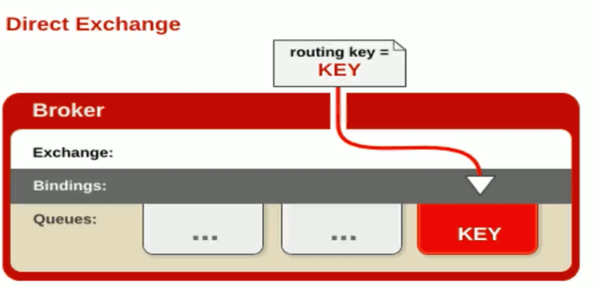
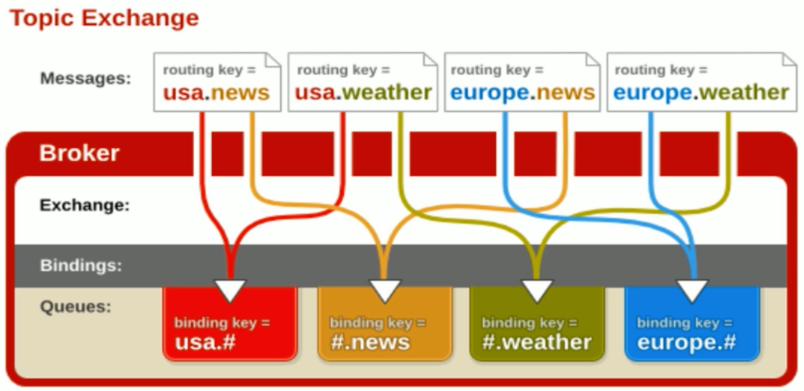
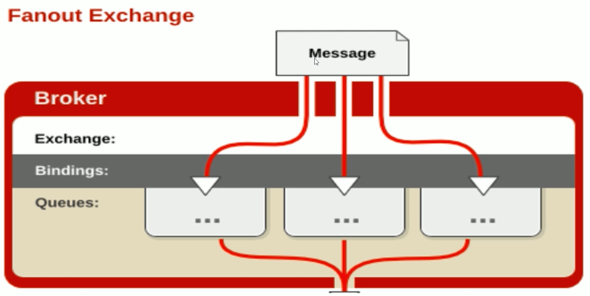

### Direct 模式

+ 所有发送到 Direct Exchange 的消息被转发到 RouteKey 中指定的 Queue。
+ Direct 模式可以使用 RabbitMQ 自带的 Exchange: default Exchange，所以不需要将 Exchange 进行任何绑定(binding)操作。
+ 消息传递时，RouteKey 必须完全匹配才会被队列接收，否则该消息会被抛弃，



```java
import com.rabbitmq.client.Channel;
import com.rabbitmq.client.Connection;
import com.rabbitmq.client.ConnectionFactory;

public class DirectProducer {
    public static void main(String[] args) throws Exception {
        //1. 创建一个 ConnectionFactory 并进行设置
        ConnectionFactory factory = new ConnectionFactory();
        factory.setHost("localhost");
        factory.setVirtualHost("/");
        factory.setUsername("guest");
        factory.setPassword("guest");

        //2. 通过连接工厂来创建连接
        Connection connection = factory.newConnection();

        //3. 通过 Connection 来创建 Channel
        Channel channel = connection.createChannel();

        //4. 声明
        String exchangeName = "test_direct_exchange";
        String routingKey = "item.direct";

        //5. 发送
        String msg = "this is direct msg";
        channel.basicPublish(exchangeName, routingKey, null, msg.getBytes());
        System.out.println("Send message : " + msg);

        //6. 关闭连接
        channel.close();
        connection.close();
    }
}

```


```java
import com.rabbitmq.client.*;
import java.io.IOException;

public class DirectConsumer {

    public static void main(String[] args) throws Exception {
        //1. 创建一个 ConnectionFactory 并进行设置
        ConnectionFactory factory = new ConnectionFactory();
        factory.setHost("localhost");
        factory.setVirtualHost("/");
        factory.setUsername("guest");
        factory.setPassword("guest");
       	factory.setAutomaticRecoveryEnabled(true);
        factory.setNetworkRecoveryInterval(3000);
      
        //2. 通过连接工厂来创建连接
        Connection connection = factory.newConnection();

        //3. 通过 Connection 来创建 Channel
        Channel channel = connection.createChannel();

        //4. 声明
        String exchangeName = "test_direct_exchange";
        String queueName = "test_direct_queue";
        String routingKey = "item.direct";
        channel.exchangeDeclare(exchangeName, "direct", true, false, null);
        channel.queueDeclare(queueName, false, false, false, null);

        //一般不用代码绑定，在管理界面手动绑定
        channel.queueBind(queueName, exchangeName, routingKey);

        //5. 创建消费者并接收消息
        Consumer consumer = new DefaultConsumer(channel) {
            @Override
            public void handleDelivery(String consumerTag, Envelope envelope,
                                       AMQP.BasicProperties properties, byte[] body)
                    throws IOException {
                String message = new String(body, "UTF-8");
                System.out.println(" [x] Received '" + message + "'");
            }
        };

        //6. 设置 Channel 消费者绑定队列
        channel.basicConsume(queueName, true, consumer);

    }
}

```


```
 Send message : this is direct msg
 
 [x] Received 'this is direct msg'
```


### Topic 模式

可以使用通配符进行模糊匹配

+ 符号'#" 匹配一个或多个词
+ 符号"*”匹配不多不少一个词

例如:

+ 'log.#"能够匹配到'log.info.oa"
+ "log.\*"只会匹配到"log.erro“



```java
import com.rabbitmq.client.Channel;
import com.rabbitmq.client.Connection;
import com.rabbitmq.client.ConnectionFactory;

public class TopicProducer {

    public static void main(String[] args) throws Exception {
        //1. 创建一个 ConnectionFactory 并进行设置
        ConnectionFactory factory = new ConnectionFactory();
        factory.setHost("localhost");
        factory.setVirtualHost("/");
        factory.setUsername("guest");
        factory.setPassword("guest");

        //2. 通过连接工厂来创建连接
        Connection connection = factory.newConnection();

        //3. 通过 Connection 来创建 Channel
        Channel channel = connection.createChannel();

        //4. 声明
        String exchangeName = "test_topic_exchange";
        String routingKey1 = "item.update";
        String routingKey2 = "item.delete";
        String routingKey3 = "user.add";

        //5. 发送
        String msg = "this is topic msg";
        channel.basicPublish(exchangeName, routingKey1, null, msg.getBytes());
        channel.basicPublish(exchangeName, routingKey2, null, msg.getBytes());
        channel.basicPublish(exchangeName, routingKey3, null, msg.getBytes());
        System.out.println("Send message : " + msg);

        //6. 关闭连接
        channel.close();
        connection.close();
    }
}

```


```java
import com.rabbitmq.client.*;
import java.io.IOException;

public class TopicConsumer {

    public static void main(String[] args) throws Exception {
        //1. 创建一个 ConnectionFactory 并进行设置
        ConnectionFactory factory = new ConnectionFactory();
        factory.setHost("localhost");
        factory.setVirtualHost("/");
        factory.setUsername("guest");
        factory.setPassword("guest");
        factory.setAutomaticRecoveryEnabled(true);
        factory.setNetworkRecoveryInterval(3000);

        //2. 通过连接工厂来创建连接
        Connection connection = factory.newConnection();

        //3. 通过 Connection 来创建 Channel
        Channel channel = connection.createChannel();

        //4. 声明
        String exchangeName = "test_topic_exchange";
        String queueName = "test_topic_queue";
        String routingKey = "item.#";
        channel.exchangeDeclare(exchangeName, "topic", true, false, null);
        channel.queueDeclare(queueName, false, false, false, null);

        //一般不用代码绑定，在管理界面手动绑定
        channel.queueBind(queueName, exchangeName, routingKey);

        //5. 创建消费者并接收消息
        Consumer consumer = new DefaultConsumer(channel) {
            @Override
            public void handleDelivery(String consumerTag, Envelope envelope,
                                       AMQP.BasicProperties properties, byte[] body)
                    throws IOException {
                String message = new String(body, "UTF-8");
                System.out.println(" [x] Received '" + message + "'");
            }
        };
        //6. 设置 Channel 消费者绑定队列
        channel.basicConsume(queueName, true, consumer);

    }
}

```


```
Send message : this is topc msg

[x] Received 'this is topc msg'
[x] Received 'this is topc msg'

```


###Fanout 模式

不处理路由键，只需要简单的将队列绑定到交换机上发送到交换机的消息都会被转发到与该交换机绑定的所有队列上。
Fanout交换机转发消息是最快的。



```java
import com.rabbitmq.client.*;
import java.io.IOException;

public class FanoutConsumer {
    public static void main(String[] args) throws Exception {
        //1. 创建一个 ConnectionFactory 并进行设置
        ConnectionFactory factory = new ConnectionFactory();
        factory.setHost("localhost");
        factory.setVirtualHost("/");
        factory.setUsername("guest");
        factory.setPassword("guest");
        factory.setAutomaticRecoveryEnabled(true);
        factory.setNetworkRecoveryInterval(3000);

        //2. 通过连接工厂来创建连接
        Connection connection = factory.newConnection();

        //3. 通过 Connection 来创建 Channel
        Channel channel = connection.createChannel();

        //4. 声明
        String exchangeName = "test_fanout_exchange";
        String queueName = "test_fanout_queue";
        String routingKey = "item.#";
        channel.exchangeDeclare(exchangeName, "fanout", true, false, null);
        channel.queueDeclare(queueName, false, false, false, null);

        //一般不用代码绑定，在管理界面手动绑定
        channel.queueBind(queueName, exchangeName, routingKey);

        //5. 创建消费者并接收消息
        Consumer consumer = new DefaultConsumer(channel) {
            @Override
            public void handleDelivery(String consumerTag, Envelope envelope,
                                       AMQP.BasicProperties properties, byte[] body)
                    throws IOException {
                String message = new String(body, "UTF-8");
                System.out.println(" [x] Received '" + message + "'");
            }
        };

        //6. 设置 Channel 消费者绑定队列
        channel.basicConsume(queueName, true, consumer);
    }
}

```


```java
import com.rabbitmq.client.Channel;
import com.rabbitmq.client.Connection;
import com.rabbitmq.client.ConnectionFactory;
public class FanoutProducer {

    public static void main(String[] args) throws Exception {
        //1. 创建一个 ConnectionFactory 并进行设置
        ConnectionFactory factory = new ConnectionFactory();
        factory.setHost("localhost");
        factory.setVirtualHost("/");
        factory.setUsername("guest");
        factory.setPassword("guest");

        //2. 通过连接工厂来创建连接
        Connection connection = factory.newConnection();

        //3. 通过 Connection 来创建 Channel
        Channel channel = connection.createChannel();

        //4. 声明
        String exchangeName = "test_fanout_exchange";
        String routingKey1 = "item.update";
        String routingKey2 = "";
        String routingKey3 = "ookjkjjkhjhk";//任意routingkey

        //5. 发送
        String msg = "this is fanout msg";
        channel.basicPublish(exchangeName, routingKey1, null, msg.getBytes());
        channel.basicPublish(exchangeName, routingKey2, null, msg.getBytes());
        channel.basicPublish(exchangeName, routingKey3, null, msg.getBytes());
        System.out.println("Send message : " + msg);

        //6. 关闭连接
        channel.close();
        connection.close();
    }
}

```


```
Send message : this is fanout msg

[x] Received 'this is fanout msg'
[x] Received 'this is fanout msg'
[x] Received 'this is fanout msg'

```

