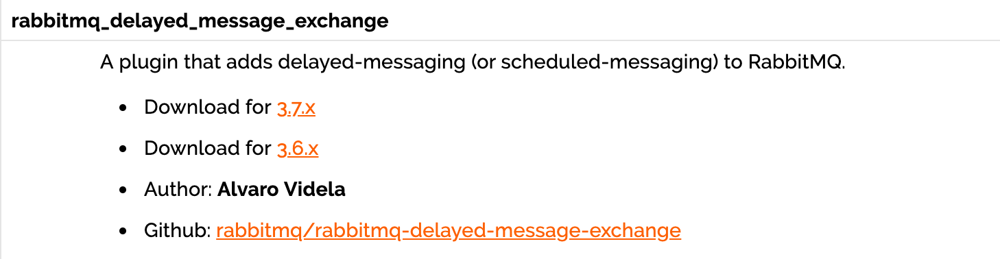

- [应用场景](#----)
- [消息延迟推送的实现](#---------)
- [测试结果](#----)
----

## 应用场景

目前常见的应用软件都有消息的延迟推送的影子，应用也极为广泛，例如：

+ 淘宝七天自动确认收货。在我们签收商品后，物流系统会在七天后延时发送一个消息给支付系统，通知支付系统将款打给商家，这个过程持续七天，就是使用了消息中间件的延迟推送功能。
+ 12306 购票支付确认页面。我们在选好票点击确定跳转的页面中往往都会有倒计时，代表着 30 分钟内订单不确认的话将会自动取消订单。其实在下订单那一刻开始购票业务系统就会发送一个延时消息给订单系统，延时30分钟，告诉订单系统订单未完成，如果我们在30分钟内完成了订单，则可以通过逻辑代码判断来忽略掉收到的消息。

在上面两种场景中，如果我们使用下面两种传统解决方案无疑大大降低了系统的整体性能和吞吐量：

+ 使用 redis 给订单设置过期时间，最后通过判断 redis 中是否还有该订单来决定时候订单已经完成。这种解决方案相较于消息的延迟推送性能较低，因为我们知道 redis 都是存储于内存中，我们遇到恶意下单或者刷单的将会给内存带来巨大压力。
+ 使用传统的数据库轮询来判断数据库表中订单的状态，这无疑增加了IO次数，性能极低。
+ 使用 jvm 原生的 DelayQueue ，也是大量占用内存，而且没有持久化策略，系统当即或者重启都会丢失订单信息。


## 消息延迟推送的实现

在 RabbitMQ 3.6.x 之前我们一般采用死信队列+TTL过期时间来实现延迟队列，我们这里不做过多介绍，可以参考之前文章来了解：

[TTL、死信队列](https://www.cnblogs.com/haixiang/p/10905189.html)

在 RabbitMQ 3.6.x 开始，RabbitMQ 官方听过了延时队列的插件，可以下载放置到 RabbitMQ 根目录下的 plugins 下。

[延迟队列插件](https://www.rabbitmq.com/community-plugins.html)




首先我们创建交换机和消息队列，application.properties 中配置与上一篇文章相同。

```java
import org.springframework.amqp.core.*;
import org.springframework.context.annotation.Bean;
import org.springframework.context.annotation.Configuration;

import java.util.HashMap;
import java.util.Map;

@Configuration
public class MQConfig {

    public static final String LAZY_EXCHANGE = "Ex.LazyExchange";
    public static final String LAZY_QUEUE = "MQ.LazyQueue";
    public static final String LAZY_KEY = "lazy.#";

    @Bean
    public TopicExchange lazyExchange(){
        //Map<String, Object> pros = new HashMap<>();
        //设置交换机支持延迟消息推送
        //pros.put("x-delayed-message", "topic");
        TopicExchange exchange = new TopicExchange(LAZY_EXCHANGE, true, false, pros);
        exchange.setDelayed(true);
        return exchange;
    }

    @Bean
    public Queue lazyQueue(){
        return new Queue(LAZY_QUEUE, true);
    }

    @Bean
    public Binding lazyBinding(){
        return BindingBuilder.bind(lazyQueue()).to(lazyExchange()).with(LAZY_KEY);
    }
}

```


我们在 Exchange 的声明中可以设置`exchange.setDelayed(true)`来开启延迟队列，也可以设置为以下内容传入交换机声明的方法中，因为第一种方式的底层就是通过这种方式来实现的。

```java
        //Map<String, Object> pros = new HashMap<>();
        //设置交换机支持延迟消息推送
        //pros.put("x-delayed-message", "topic");
        TopicExchange exchange = new TopicExchange(LAZY_EXCHANGE, true, false, pros);
```


发送消息时我们需要指定延迟推送的时间，我们这里在发送消息的方法中传入参数 `new MessagePostProcessor()` 是为了获得 `Message`对象，因为需要借助 `Message`对象的api 来设置延迟时间。

```java
import com.anqi.mq.config.MQConfig;
import org.springframework.amqp.AmqpException;
import org.springframework.amqp.core.Message;
import org.springframework.amqp.core.MessageDeliveryMode;
import org.springframework.amqp.core.MessagePostProcessor;
import org.springframework.amqp.rabbit.connection.CorrelationData;
import org.springframework.amqp.rabbit.core.RabbitTemplate;
import org.springframework.beans.factory.annotation.Autowired;
import org.springframework.stereotype.Component;

import java.util.Date;

@Component
public class MQSender {

    @Autowired
    private RabbitTemplate rabbitTemplate;

    //confirmCallback returnCallback 代码省略，请参照上一篇
  
		public void sendLazy(Object message){
        rabbitTemplate.setMandatory(true);
        rabbitTemplate.setConfirmCallback(confirmCallback);
        rabbitTemplate.setReturnCallback(returnCallback);
        //id + 时间戳 全局唯一
        CorrelationData correlationData = new CorrelationData("12345678909"+new Date());

        //发送消息时指定 header 延迟时间
        rabbitTemplate.convertAndSend(MQConfig.LAZY_EXCHANGE, "lazy.boot", message,
                new MessagePostProcessor() {
            @Override
            public Message postProcessMessage(Message message) throws AmqpException {
                //设置消息持久化
                message.getMessageProperties().setDeliveryMode(MessageDeliveryMode.PERSISTENT);
                //message.getMessageProperties().setHeader("x-delay", "6000");
                message.getMessageProperties().setDelay(6000);
                return message;
            }
        }, correlationData);
    }
}
```


我们可以观察 `setDelay(Integer i)`底层代码，也是在 header 中设置 s-delay。等同于我们手动设置 header

`message.getMessageProperties().setHeader("x-delay", "6000");`

```java
/**
 * Set the x-delay header.
 * @param delay the delay.
 * @since 1.6
 */
public void setDelay(Integer delay) {
	if (delay == null || delay < 0) {
		this.headers.remove(X_DELAY);
	}
	else {
		this.headers.put(X_DELAY, delay);
	}
}
```


消费端进行消费

```java
import com.rabbitmq.client.Channel;
import org.springframework.amqp.rabbit.annotation.*;
import org.springframework.amqp.support.AmqpHeaders;
import org.springframework.stereotype.Component;

import java.io.IOException;
import java.util.Map;

@Component
public class MQReceiver {

    @RabbitListener(queues = "MQ.LazyQueue")
    @RabbitHandler
    public void onLazyMessage(Message msg, Channel channel) throws IOException{
        long deliveryTag = msg.getMessageProperties().getDeliveryTag();
        channel.basicAck(deliveryTag, true);
        System.out.println("lazy receive " + new String(msg.getBody()));

    }
```


## 测试结果

```java
import org.junit.Test;
import org.junit.runner.RunWith;
import org.springframework.beans.factory.annotation.Autowired;
import org.springframework.boot.test.context.SpringBootTest;
import org.springframework.test.context.junit4.SpringRunner;

@SpringBootTest
@RunWith(SpringRunner.class)
public class MQSenderTest {

    @Autowired
    private MQSender mqSender;

    @Test
    public void sendLazy() throws  Exception {
        String msg = "hello spring boot";

        mqSender.sendLazy(msg + ":");
    }
}
```

果然在 6 秒后收到了消息 `lazy receive hello spring boot:`

