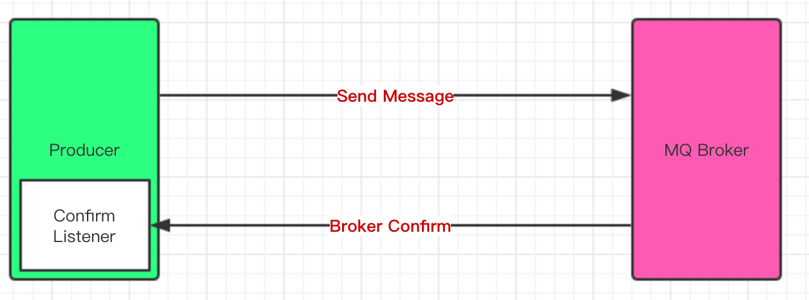
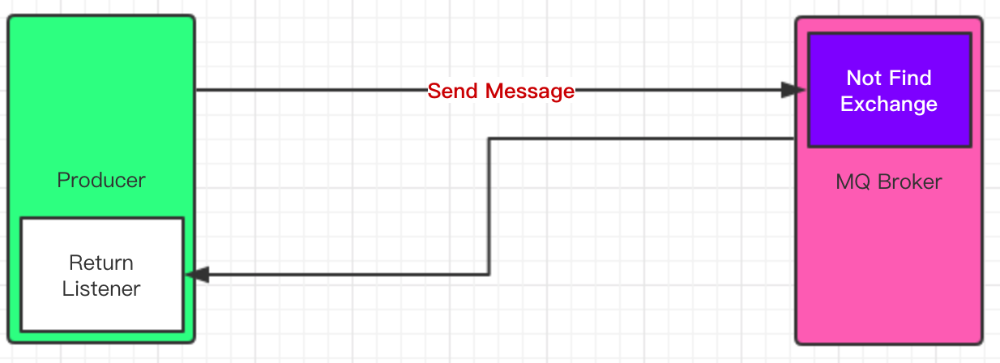

- [生产端 Confirm 消息确认机制](#----confirm-------)
  * [Confirm 确认机制流程图](#confirm--------)
  * [如何实现Confirm确认消息?](#----confirm-----)
  * [注意事项](#----)
- [Return 消息机制](#return-----)
  * [Return 消息机制流程图](#return--------)
  * [Return 消息式例](#return-----)
- [消费端 Ack 和 Nack 机制](#----ack---nack---)
  * [参考 api](#---api)
  * [如何设置手动 Ack 、Nack 以及重回队列](#-------ack--nack-------)
-------

## 生产端 Confirm 消息确认机制

消息的确认，是指生产者投递消息后，如果 Broker 收到消息，则会给我们生产者一个应答。生产者进行接收应答，用来确定这条消息是否正常的发送到 Broker ，这种方式也是消息的可靠性投递的核心保障!


### Confirm 确认机制流程图




### 如何实现Confirm确认消息?

+ 第一步:在 channel 上开启确认模式: `channel.confirmSelect()`
+ 第二步:在 channel 上添加监听: `channel.addConfirmListener(ConfirmListener listener);`, 监听成功和失败的返回结果，根据具体的结果对消息进行重新发送、或记录日志等后续处理!

```java
import com.rabbitmq.client.Channel;
import com.rabbitmq.client.ConfirmListener;
import com.rabbitmq.client.Connection;
import com.rabbitmq.client.ConnectionFactory;

import java.io.IOException;

public class ConfirmProducer {
    public static void main(String[] args) throws Exception {
        ConnectionFactory factory = new ConnectionFactory();
        factory.setHost("localhost");
        factory.setVirtualHost("/");
        factory.setUsername("guest");
        factory.setPassword("guest");

        Connection connection = factory.newConnection();

        Channel channel = connection.createChannel();

        String exchangeName = "test_confirm_exchange";
        String routingKey = "item.update";

        //指定消息的投递模式：confirm 确认模式
        channel.confirmSelect();

        //发送
        final long start = System.currentTimeMillis();
        for (int i = 0; i < 5 ; i++) {
            String msg = "this is confirm msg ";
            channel.basicPublish(exchangeName, routingKey, null, msg.getBytes());
            System.out.println("Send message : " + msg);
        }

        //添加一个确认监听， 这里就不关闭连接了，为了能保证能收到监听消息
        channel.addConfirmListener(new ConfirmListener() {
            /**
             * 返回成功的回调函数
             */
            public void handleAck(long deliveryTag, boolean multiple) throws IOException {
                System.out.println("succuss ack");
                System.out.println(multiple);
                System.out.println("耗时：" + (System.currentTimeMillis() - start) + "ms");
            }
            /**
             * 返回失败的回调函数
             */
            public void handleNack(long deliveryTag, boolean multiple) throws IOException {
                System.out.printf("defeat ack");
                System.out.println("耗时：" + (System.currentTimeMillis() - start) + "ms");
            }
        });
    }
}
```


```java
import com.rabbitmq.client.*;
import java.io.IOException;

public class ConfirmConsumer {
    public static void main(String[] args) throws Exception {
        ConnectionFactory factory = new ConnectionFactory();
        factory.setHost("localhost");
        factory.setVirtualHost("/");
        factory.setUsername("guest");
        factory.setPassword("guest");
        factory.setAutomaticRecoveryEnabled(true);
        factory.setNetworkRecoveryInterval(3000);

        Connection connection = factory.newConnection();

        Channel channel = connection.createChannel();
      
        String exchangeName = "test_confirm_exchange";
        String queueName = "test_confirm_queue";
        String routingKey = "item.#";
        channel.exchangeDeclare(exchangeName, "topic", true, false, null);
        channel.queueDeclare(queueName, false, false, false, null);

        //一般不用代码绑定，在管理界面手动绑定
        channel.queueBind(queueName, exchangeName, routingKey);

        //创建消费者并接收消息
        Consumer consumer = new DefaultConsumer(channel) {
            @Override
            public void handleDelivery(String consumerTag, Envelope envelope,
                                       AMQP.BasicProperties properties, byte[] body)
                    throws IOException {
                String message = new String(body, "UTF-8");
                System.out.println(" [x] Received '" + message + "'");
            }
        };

        //设置 Channel 消费者绑定队列
        channel.basicConsume(queueName, true, consumer);

    }
}
```

我们此处只关注生产端输出消息

```
Send message : this is confirm msg 
Send message : this is confirm msg 
Send message : this is confirm msg 
Send message : this is confirm msg 
Send message : this is confirm msg 
succuss ack
true
耗时：3ms
succuss ack
true
耗时：4ms
```


### 注意事项

+ 我们采用的是异步 confirm 模式：提供一个回调方法，服务端 confirm 了一条或者多条消息后 Client 端会回调这个方法。除此之外还有单条同步 confirm 模式、批量同步 confirm 模式，由于现实场景中很少使用我们在此不做介绍，如有兴趣直接参考官方文档。

+ 我们运行生产端会发现每次运行结果都不一样,会有多种情况出现，因为 Broker 会进行优化，有时会批量一次性 confirm ，有时会分开几条 confirm。

+ ```java
  succuss ack
  true
  耗时：3ms
  succuss ack
  false
  耗时：4ms
  
  或者
  succuss ack
  true
  耗时：3ms
  ```


## Return 消息机制

+ Return Listener 用于处理一-些不可路 由的消息!
+ 消息生产者，通过指定一个 `Exchange` 和 `Routingkey`，把消息送达到某一个队列中去，然后我们的消费者监听队列，进行消费处理操作!
+ 但是在某些情况下，如果我们在发送消息的时候，当前的 exchange 不存在或者指定的路由 key 路由不到，这个时候如果我们需要监听这种不可达的消息，就要使用 `Return Listener !`

+ 在基础API中有一个关键的配置项:`Mandatory`：如果为 `true`，则监听器会接收到路由不可达的消息，然后进行后续处理，如果为 `false`，那么 broker 端自动删除该消息!


### Return 消息机制流程图




### Return 消息式例

+ 首先我们需要发送三条消息，并且故意将第 0 条消息的 `routing Key`设置为错误的，让他无法正常路由到消费端。

+ `mandatory` 设置为 `true` 路由不可达的消息会被监听到，不会被自动删除.即`channel.basicPublish(exchangeName, errRoutingKey, true,null, msg.getBytes());`
+ 最后添加监听即可监听到不可路由到消费端的消息`channel.addReturnListener(ReturnListener r)) `

```java
import com.rabbitmq.client.*;
import java.io.IOException;

public class ReturnListeningProducer {
    public static void main(String[] args) throws Exception {
        ConnectionFactory factory = new ConnectionFactory();
        factory.setHost("localhost");
        factory.setVirtualHost("/");
        factory.setUsername("guest");
        factory.setPassword("guest");
      
        Connection connection = factory.newConnection();
        Channel channel = connection.createChannel();

        String exchangeName = "test_return_exchange";
        String routingKey = "item.update";
        String errRoutingKey = "error.update";

        //指定消息的投递模式：confirm 确认模式
        channel.confirmSelect();

        //发送
        for (int i = 0; i < 3 ; i++) {
            String msg = "this is return——listening msg ";
            //@param mandatory 设置为 true 路由不可达的消息会被监听到，不会被自动删除
            if (i == 0) {
                channel.basicPublish(exchangeName, errRoutingKey, true,null, msg.getBytes());
            } else {
                channel.basicPublish(exchangeName, routingKey, true, null, msg.getBytes());
            }
            System.out.println("Send message : " + msg);
        }

        //添加一个确认监听， 这里就不关闭连接了，为了能保证能收到监听消息
        channel.addConfirmListener(new ConfirmListener() {
            /**
             * 返回成功的回调函数
             */
            public void handleAck(long deliveryTag, boolean multiple) throws IOException {
                System.out.println("succuss ack");
            }
            /**
             * 返回失败的回调函数
             */
            public void handleNack(long deliveryTag, boolean multiple) throws IOException {
                System.out.printf("defeat ack");
            }
        });

        //添加一个 return 监听
        channel.addReturnListener(new ReturnListener() {
            public void handleReturn(int replyCode, String replyText, String exchange, String routingKey, AMQP.BasicProperties properties, byte[] body) throws IOException {
                System.out.println("return relyCode: " + replyCode);
                System.out.println("return replyText: " + replyText);
                System.out.println("return exchange: " + exchange);
                System.out.println("return routingKey: " + routingKey);
                System.out.println("return properties: " + properties);
                System.out.println("return body: " + new String(body));
            }
        });

    }
}
```


```java
import com.rabbitmq.client.*;
import java.io.IOException;

public class ReturnListeningConsumer {
    public static void main(String[] args) throws Exception {
        //1. 创建一个 ConnectionFactory 并进行设置
        ConnectionFactory factory = new ConnectionFactory();
        factory.setHost("localhost");
        factory.setVirtualHost("/");
        factory.setUsername("guest");
        factory.setPassword("guest");
        factory.setAutomaticRecoveryEnabled(true);
        factory.setNetworkRecoveryInterval(3000);

        //2. 通过连接工厂来创建连接
        Connection connection = factory.newConnection();

        //3. 通过 Connection 来创建 Channel
        Channel channel = connection.createChannel();

        //4. 声明
        String exchangeName = "test_return_exchange";
        String queueName = "test_return_queue";
        String routingKey = "item.#";

        channel.exchangeDeclare(exchangeName, "topic", true, false, null);
        channel.queueDeclare(queueName, false, false, false, null);

        //一般不用代码绑定，在管理界面手动绑定
        channel.queueBind(queueName, exchangeName, routingKey);

        //5. 创建消费者并接收消息
        Consumer consumer = new DefaultConsumer(channel) {
            @Override
            public void handleDelivery(String consumerTag, Envelope envelope,
                                       AMQP.BasicProperties properties, byte[] body)
                    throws IOException {
                String message = new String(body, "UTF-8");
                System.out.println(" [x] Received '" + message + "'");
            }
        };

        //6. 设置 Channel 消费者绑定队列
        channel.basicConsume(queueName, true, consumer);
    }
}

```


我们只关注生产端结果，消费端只收到两条消息。

```
Send message : this is return——listening msg 
Send message : this is return——listening msg 
Send message : this is return——listening msg 
return relyCode: 312
return replyText: NO_ROUTE
return exchange: test_return_exchange
return routingKey: error.update
return properties: #contentHeader<basic>(content-type=null, content-encoding=null, headers=null, delivery-mode=null, priority=null, correlation-id=null, reply-to=null, expiration=null, message-id=null, timestamp=null, type=null, user-id=null, app-id=null, cluster-id=null)
return body: this is return——listening msg 
succuss ack
succuss ack
succuss ack
```


## 消费端 Ack 和 Nack 机制

消费端进行消费的时候，如果由于业务异常我们可以进行日志的记录，然后进行补偿!如果由于服务器宕机等严重问题，那我们就需要手工进行ACK保障消费端消费成功!消费端重回队列是为了对没有处理成功的消息，把消息重新会递给Broker!一般我们在实际应用中，都会关闭重回队列，也就是设置为False。


### 参考 api

`void basicNack(long deliveryTag, boolean multiple, boolean requeue) throws IOException;`

`void basicAck(long deliveryTag, boolean multiple) throws IOException;`


### 如何设置手动 Ack 、Nack 以及重回队列

+ 首先我们发送五条消息，将每条消息对应的循环下标 i 放入消息的 `properties` 中作为标记，以便于我们在后面的回调方法中识别。

+ 其次， 我们将消费端的 ·`channel.basicConsume(queueName, false, consumer);` 中的 `autoAck`属性设置为 `false`，如果设置为`true`的话 将会正常输出五条消息。

+ 我们通过 `Thread.sleep(2000)`来延时一秒，用以看清结果。我们获取到`properties`中的`num`之后，通过`channel.basicNack(envelope.getDeliveryTag(), false, true);`将 `num`为0的消息设置为 nack，即消费失败，并且将 `requeue`属性设置为`true`，即消费失败的消息重回队列末端。

```java
import com.rabbitmq.client.*;
import java.util.HashMap;
import java.util.Map;

public class AckAndNackProducer {
    public static void main(String[] args) throws Exception {
        ConnectionFactory factory = new ConnectionFactory();
        factory.setHost("localhost");
        factory.setVirtualHost("/");
        factory.setUsername("guest");
        factory.setPassword("guest");

        Connection connection = factory.newConnection();
        Channel channel = connection.createChannel();

        String exchangeName = "test_ack_exchange";
        String routingKey = "item.update";

        String msg = "this is ack msg";
        for (int i = 0; i < 5; i++) {
            Map<String, Object> headers = new HashMap<String, Object>();
            headers.put("num" ,i);

            AMQP.BasicProperties properties = new AMQP.BasicProperties().builder()
                    .deliveryMode(2)
                    .headers(headers)
                    .build();

            String tem = msg + ":" + i;

            channel.basicPublish(exchangeName, routingKey, true, properties, tem.getBytes());
            System.out.println("Send message : " + msg);
        }

        channel.close();
        connection.close();
    }
}
```


```java
import com.rabbitmq.client.*;
import java.io.IOException;

public class AckAndNackConsumer {
    public static void main(String[] args) throws Exception {
        ConnectionFactory factory = new ConnectionFactory();
        factory.setHost("localhost");
        factory.setVirtualHost("/");
        factory.setUsername("guest");
        factory.setPassword("guest");
        factory.setAutomaticRecoveryEnabled(true);
        factory.setNetworkRecoveryInterval(3000);

        Connection connection = factory.newConnection();

        final Channel channel = connection.createChannel();

        String exchangeName = "test_ack_exchange";
        String queueName = "test_ack_queue";
        String routingKey = "item.#";
        channel.exchangeDeclare(exchangeName, "topic", true, false, null);
        channel.queueDeclare(queueName, false, false, false, null);

        //一般不用代码绑定，在管理界面手动绑定
        channel.queueBind(queueName, exchangeName, routingKey);

        Consumer consumer = new DefaultConsumer(channel) {
            @Override
            public void handleDelivery(String consumerTag, Envelope envelope,
                                       AMQP.BasicProperties properties, byte[] body)
                    throws IOException {

                String message = new String(body, "UTF-8");
                System.out.println(" [x] Received '" + message + "'");

                try {
                    Thread.sleep(2000);
                } catch (InterruptedException e) {
                    e.printStackTrace();
                }

                if ((Integer) properties.getHeaders().get("num") == 0) {
                    channel.basicNack(envelope.getDeliveryTag(), false, true);
                } else {
                    channel.basicAck(envelope.getDeliveryTag(), false);
                }
            }
        };

        //6. 设置 Channel 消费者绑定队列
        channel.basicConsume(queueName, false, consumer);

    }
}
```

我们此处只关心消费端输出，可以看到第 0 条消费失败重新回到队列尾部消费。

```
 [x] Received 'this is ack msg:1'
 [x] Received 'this is ack msg:2'
 [x] Received 'this is ack msg:3'
 [x] Received 'this is ack msg:4'
 [x] Received 'this is ack msg:0'
 [x] Received 'this is ack msg:0'
 [x] Received 'this is ack msg:0'
 [x] Received 'this is ack msg:0'
 [x] Received 'this is ack msg:0'
```

