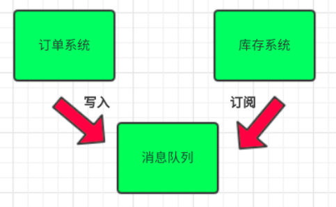
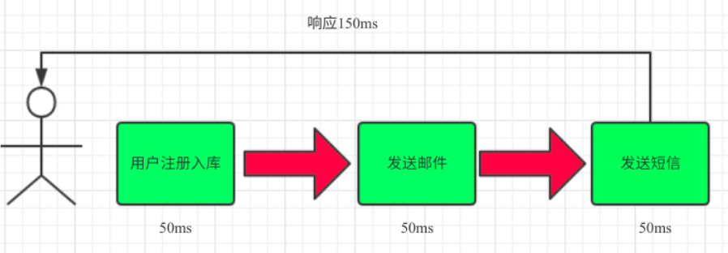

- [一. RabbitMQ 简介](#--r简介---)
- [二. RabbitMQ 使用场景](#--使用场景-----)
  * [1. 解耦（为面向服务的架构（SOA）提供基本的最终一致性实现）](#1-------------soa--------------)
  * [2. 异步提升效率](#2-------)
  * [3. 流量削峰](#3-----)
- [三. 引入消息队列的优缺点](#------------)
  * [优点](#--)
  * [缺点](#--)
  * [总结](#--)
-----

## 一. RabbitMQ 简介
MQ全称为Message Queue, [消息队列](https://baike.baidu.com/item/%E6%B6%88%E6%81%AF%E9%98%9F%E5%88%97/4751675)（MQ）是一种应用程序对应用程序的通信方法。应用程序通过读写出入队列的消息（针对应用程序的数据）来通信，而无需专用连接来链接它们。消息传递指的是程序之间通过在消息中发送数据进行通信，而不是通过直接调用彼此来通信，直接调用通常是用于诸如远程过程调用的技术。排队指的是应用程序通过 队列来通信。队列的使用除去了接收和发送应用程序同时执行的要求。

RabbitMQ是使用Erlang语言开发的开源消息队列系统，基于AMQP协议来实现。AMQP的主要特征是面向消息、队列、路由(包括点对点和发布/订阅)、可靠性、 安全。AMQP协议更多用在企业系统内，对数据一致性、稳定性和可靠性要求很高的场景，对性能和吞吐量的要求还在其次。
## 二. RabbitMQ 使用场景

### 1. 解耦（为面向服务的架构（SOA）提供基本的最终一致性实现）

场景说明：用户下单后，订单系统需要通知库存系统。传统的做法是，订单系统调用库存系统的接口。

传统模式的缺点：

- 假如库存系统无法访问，则订单减库存将失败，从而导致订单失败
- 订单系统与库存系统耦合

引入消息队列

- 订单系统：用户下单后，订单系统完成持久化处理，将消息写入消息队列，返回用户订单下单成功
- 库存系统：订阅下单的消息，采用拉/推的方式，获取下单信息，库存系统根据下单信息，进行库存操作
- 假如：在下单时库存系统不能正常使用。也不影响正常下单，因为下单后，订单系统写入消息队列就不再关心其他的后续操作了。实现订单系统与库存系统的应用解耦  
- 为了保证库存肯定有，可以将队列大小设置成库存数量，或者采用其他方式解决。

基于消息的模型，关心的是“通知”，而非“处理”。

短信、邮件通知、缓存刷新等操作使用消息队列进行通知。

消息队列和RPC的区别与比较：

RPC: 异步调用，及时获得调用结果，具有强一致性结果，关心业务调用处理结果。

消息队列：两次异步RPC调用，将调用内容在队列中进行转储，并选择合适的时机进行投递（错峰流控）

### 2. 异步提升效率

场景说明：用户注册后，需要发注册邮件和注册短信。传统的做法有两种 1.串行的方式；2.并行方式

（1）串行方式：将注册信息写入数据库成功后，发送注册邮件，再发送注册短信。以上三个任务全部完成后，返回给客户端

（2）并行方式：将注册信息写入数据库成功后，发送注册邮件的同时，发送注册短信。以上三个任务完成后，返回给客户端。与串行的差别是，并行的方式可以提高处理的时间

（3）引入消息队列，将不是必须的业务逻辑，异步处理。改造后的架构如下：

### 3. 流量削峰
流量削锋也是消息队列中的常用场景，一般在秒杀或团抢活动中使用广泛

应用场景：系统其他时间A系统每秒请求量就100个，系统可以稳定运行。系统每天晚间八点有秒杀活动，每秒并发请求量增至1万条，但是系统最大的处理能力只能每秒处理1000个请求，于是系统崩溃，服务器宕机。

之前架构：大量用户（100万用户）通过浏览器在晚上八点高峰期同时参与秒杀活动。大量的请求涌入我们的系统中，高峰期达到每秒钟5000个请求，大量的请求打到MySQL上，每秒钟预计执行3000条SQL。但是一般的MySQL每秒钟扛住2000个请求就不错了，如果达到3000个请求的话可能MySQL直接就瘫痪了，从而系统无法被使用。但是高峰期过了之后，就成了低峰期，可能也就1万用户访问系统，每秒的请求数量也就50个左右，整个系统几乎没有任何压力。

引入MQ：100万用户在高峰期的时候，每秒请求有5000个请求左右，将这5000请求写入MQ里面，系统A每秒最多只能处理2000请求，因为MySQL每秒只能处理2000个请求。系统A从MQ中慢慢拉取请求，每秒就拉取2000个请求，不要超过自己每秒能处理的请求数量即可。MQ，每秒5000个请求进来，结果只有2000个请求出去，所以在秒杀期间（将近一小时）可能会有几十万或者几百万的请求积压在MQ中。这个短暂的高峰期积压是没问题的，因为高峰期过了之后，每秒就只有50个请求进入MQ了，但是系统还是按照每秒2000个请求的速度在处理，所以说，只要高峰期一过，系统就会快速将积压的消息消费掉。我们在此计算一下，每秒在MQ积压3000条消息，1分钟会积压18万，1小时积压1000万条消息，高峰期过后，1个多小时就可以将积压的1000万消息消费掉。

## 三. 引入消息队列的优缺点

### 优点
优点就是以上的那些场景应用，就是在特殊场景下有其对应的好处，**解耦**、**异步**、**削峰**。

### 缺点
* 系统的可用性降低
系统引入的外部依赖越多，系统越容易挂掉，本来只是A系统调用BCD三个系统接口就好，ABCD四个系统不报错整个系统会正常运行。引入了MQ之后，虽然ABCD系统没出错，但MQ挂了以后，整个系统也会崩溃。
* 系统的复杂性提高
引入了MQ之后，需要考虑的问题也变得多了，如何保证消息没有重复消费？如何保证消息不丢失？怎么保证消息传递的顺序？
* 一致性问题
A系统发送完消息直接返回成功，但是BCD系统之中若有系统写库失败，则会产生数据不一致的问题。

### 总结
所以总结来说，消息队列是一种十分复杂的架构，引入它有很多好处，但是也得针对它带来的坏处做各种额外的技术方案和架构来规避。引入MQ系统复杂度提升了一个数量级，但是在有些场景下，就是复杂十倍百倍，还是需要使用MQ。
