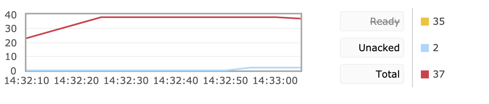

[TOC]

-------

###说明

本此 SpringBoot 与 RabbitMQ 进行整合的时候，包含了三种消息的确认模式，如果查询详细的确认模式设置，请阅读：

[RabbitMQ的三种消息确认模式]: https://www.cnblogs.com/haixiang/p/10900005.html	"消息确认模式"

同事消费端也采取了限流的措施，如果对限流细节有兴趣请参照之前的文章阅读

[RabbitMQ 消费端限流、TTL、死信队列]: https://www.cnblogs.com/haixiang/p/10905189.html	"消费端限流"


###生产端

首先引入 maven 依赖

```java
		<dependency>
        <groupId>org.springframework.boot</groupId>
        <artifactId>spring-boot-starter-amqp</artifactId>
        <version>2.1.4.RELEASE</version>
    </dependency>
```


Application.properties 中进行设置，开启 confirm 确认机制，开启 return 确认模式，设置 `mandatory`属性 为 true，当设置为 true 的时候，路由不到队列的消息不会被自动删除，从而才可以被 return 消息模式监听到。

```properties
spring.rabbitmq.host=localhost
spring.rabbitmq.port=5672
spring.rabbitmq.username=guest
spring.rabbitmq.password=guest
spring.rabbitmq.virtual-host=/
spring.rabbitmq.connection-timeout=15000

#开启 confirm 确认机制
spring.rabbitmq.publisher-confirms=true
#开启 return 确认机制
spring.rabbitmq.publisher-returns=true
#设置为 true 后 消费者在消息没有被路由到合适队列情况下会被return监听，而不会自动删除
spring.rabbitmq.template.mandatory=true
        
```


创建队列和交换机，此处不应该创建 ConnectionFactory 和 RabbitAdmin，应该在 application.properties 中设置用户名、密码、host、端口、虚拟主机即可。

```java
import org.springframework.amqp.core.Exchange;
import org.springframework.amqp.core.Queue;
import org.springframework.amqp.core.TopicExchange;
import org.springframework.context.annotation.Bean;
import org.springframework.context.annotation.Configuration;

@Configuration
public class MQConfig {
//    @Bean
//    public ConnectionFactory connectionFactory(){
//        return new CachingConnectionFactory();
//    }
//
//    @Bean
//    public RabbitAdmin rabbitAdmin(){
//        return new RabbitAdmin(connectionFactory());
//    }
    @Bean
    public Exchange bootExchange(){
        return new TopicExchange("BOOT-EXCHANGE-1", true, false);
    }

    @Bean
    public Queue bootQueue(){
        return new Queue("boot.queue1", true);
    }
}
```


如果程序有特殊的设置要求，追求更灵活的设置可以参考以下方式进行编码设置，从而不用在application.properties 指定。例如我们在测试环境和生产环境中配置的虚拟主机、密码不同、我们可以在程序中判断处于哪种环境，灵活切换设置。

```java
    @Bean
    public ConnectionFactory connectionFactory(){
        CachingConnectionFactory connectionFactory = new CachingConnectionFactory();
      	if("生产环境"){
          connectionFactory.set.....
        } else {
          ......
        }
        connectionFactory.setVirtualHost("/");
        connectionFactory.setUsername("guest");
        connectionFactory.setPassword("guest");
        return connectionFactory;
    }

    @Bean
    public RabbitAdmin rabbitAdmin(){
        RabbitAdmin rabbitAdmin = new RabbitAdmin();
        rabbitAdmin.setAutoStartup(true);
        return new RabbitAdmin(connectionFactory());
    }
```


MQSender代码如下，包含发送消息以及添加 confirm 监听、添加 return 监听。如果消费端要设置为手工 ACK ，那么生产端发送消息的时候一定发送 correlationData ，并且全局唯一，用以唯一标识消息。

```java
import com.anqi.mq.bean.User;
import org.springframework.amqp.core.Message;
import org.springframework.amqp.core.MessageProperties;
import org.springframework.amqp.rabbit.connection.CorrelationData;
import org.springframework.amqp.rabbit.core.RabbitTemplate;
import org.springframework.beans.factory.annotation.Autowired;
import org.springframework.stereotype.Component;

import java.util.Date;
import java.util.Map;

@Component
public class MQSender {

    @Autowired
    private RabbitTemplate rabbitTemplate;

    final RabbitTemplate.ConfirmCallback confirmCallback= new RabbitTemplate.ConfirmCallback() {

        public void confirm(CorrelationData correlationData, boolean ack, String cause) {
            System.out.println("correlationData: " + correlationData);
            System.out.println("ack: " + ack);
            if(!ack){
                System.out.println("异常处理....");
            }
        }

    };

    final RabbitTemplate.ReturnCallback returnCallback = new RabbitTemplate.ReturnCallback() {

        public void returnedMessage(Message message, int replyCode, String replyText, String exchange, String routingKey) {
            System.out.println("return exchange: " + exchange + ", routingKey: "
                    + routingKey + ", replyCode: " + replyCode + ", replyText: " + replyText);
        }
    };

    //发送消息方法调用: 构建Message消息
    public void send(Object message, Map<String, Object> properties) throws Exception {
        MessageProperties mp = new MessageProperties();
        //在生产环境中这里不用Message，而是使用 fastJson 等工具将对象转换为 json 格式发送
        Message msg = new Message(message.toString().getBytes(),mp);
        rabbitTemplate.setMandatory(true);
        rabbitTemplate.setConfirmCallback(confirmCallback);
        rabbitTemplate.setReturnCallback(returnCallback);
        //id + 时间戳 全局唯一
        CorrelationData correlationData = new CorrelationData("1234567890"+new Date());
        rabbitTemplate.convertAndSend("BOOT-EXCHANGE-1", "boot.save", msg, correlationData);
    }
    //发送消息方法调用: 构建Message消息
    public void sendUser(User user) throws Exception {
        rabbitTemplate.setMandatory(true);
        rabbitTemplate.setConfirmCallback(confirmCallback);
        rabbitTemplate.setReturnCallback(returnCallback);
        //id + 时间戳 全局唯一
        CorrelationData correlationData = new CorrelationData("1234567890"+new Date());
        rabbitTemplate.convertAndSend("BOOT-EXCHANGE-1", "boot.save", user, correlationData);
    }
}

```


### 消费端

在实际生产环境中，生产端和消费端一般都是两个系统，我们在此也将拆分成两个项目。

以下为消费端的 application.properties 中的配置，首先配置手工确认模式，用于 ACK 的手工处理，这样我们可以保证消息的可靠性送达，或者在消费端消费失败的时候可以做到重回队列、根据业务记录日志等处理。我们也可以设置消费端的监听个数和最大个数，用于控制消费端的并发情况。我们要开启限流，指定每次处理消息最多只能处理两条消息。

```properties
spring.rabbitmq.host=localhost
spring.rabbitmq.virtual-host=/
spring.rabbitmq.username=guest
spring.rabbitmq.password=guest


#设置消费端手动 ack
spring.rabbitmq.listener.simple.acknowledge-mode=manual
#消费者最小数量
spring.rabbitmq.listener.simple.concurrency=1
#消费之最大数量
spring.rabbitmq.listener.simple.max-concurrency=10

#在单个请求中处理的消息个数，他应该大于等于事务数量(unack的最大数量)
spring.rabbitmq.listener.simple.prefetch=2

```


我们可以使用 `@RabbitListener` 和`@RabblitHandler`组合来监听队列，当然`@RabbitListener` 也可以加在方法上。我们这里是创建了两个方法用来监听同一个队列，具体调用哪个方法是通过匹配方法的入参来决定的，自定义类型的消息需要标注`@Payload`，类要实现序列化接口。

```java
package com.anqi.mq.receiver;

import com.anqi.mq.bean.User;
import com.rabbitmq.client.Channel;
import org.springframework.amqp.core.Message;
import org.springframework.amqp.rabbit.annotation.*;
import org.springframework.amqp.support.AmqpHeaders;
import org.springframework.messaging.handler.annotation.Headers;
import org.springframework.messaging.handler.annotation.Payload;
import org.springframework.stereotype.Component;

import java.io.IOException;
import java.util.Map;


@RabbitListener(
        bindings = @QueueBinding(
                value = @Queue(value = "boot.queue1", durable = "true"),
                exchange = @Exchange(value = "BOOT-EXCHANGE-1", type = "topic", durable = "true", ignoreDeclarationExceptions = "true"),
                key = "boot.*"
        )
)
@Component
public class MQReceiver {

    @RabbitHandler
    public void onMessage(Message message, Channel channel) throws IOException {

        try {
            Thread.sleep(5000);
        } catch (InterruptedException e) {
            e.printStackTrace();
        }
        long deliveryTag = message.getMessageProperties().getDeliveryTag();
        //手工ack
        channel.basicAck(deliveryTag,true);
        System.out.println("receive--1: " + new String(message.getBody()));
    }

   @RabbitHandler
    public void onUserMessage(@Payload User user, Channel channel, @Headers Map<String,Object> headers) throws IOException {

        try {
            Thread.sleep(5000);
        } catch (InterruptedException e) {
            e.printStackTrace();
        }

        long deliveryTag = (Long)headers.get(AmqpHeaders.DELIVERY_TAG);
        //手工ack
        channel.basicAck(deliveryTag,true);
        System.out.println("receive--11: " + user.toString());
    }
}

```


消息的序列化与反序列化由内部转换器完成，如果我们要采用其他类型的消息转换器，我们可以对其进行设置` SimpleMessageListenerContainer `。

```java
    @Bean
    public SimpleMessageListenerContainer simpleMessageListenerContainer(){
        SimpleMessageListenerContainer container = new SimpleMessageListenerContainer(connectionFactory());
        container.setMessageConverter(new Jackson2JsonMessageConverter());
        // 默认采用下面的这种转换器
        // container.setMessageConverter(new SimpleMessageConverter());
        return container;
    }
```


单元测试类

```java
import com.anqi.mq.bean.User;
import org.junit.Test;
import org.junit.runner.RunWith;
import org.springframework.beans.factory.annotation.Autowired;
import org.springframework.boot.test.context.SpringBootTest;
import org.springframework.test.context.junit4.SpringRunner;

@SpringBootTest
@RunWith(SpringRunner.class)
public class MQSenderTest {

    @Autowired
    private MQSender mqSender;

    @Test
    public void send() {
        String msg = "hello spring boot";
        try {
            for (int i = 0; i < 15; i++) {
                try {
                    Thread.sleep(1000);
                } catch (InterruptedException e) {
                    e.printStackTrace();
                }
                //mqSender.send(msg + ":" + i, null);
                mqSender.sendUser(new User("anqi", 25));
            }
        } catch (Exception e) {
            e.printStackTrace();
        }
    }
}
```


测试结果如下，我们在消费方法使用了`Thread.sleep(5000)`来模拟消息的处理过程，故意的延长了消息的处理时间，从而更好的观察限流效果。我们可以发现`Unacked`一直是 2， 代表正在处理的消息数量为 2，这与我们限流的数量一致，说明了限流的目的已经实现。




