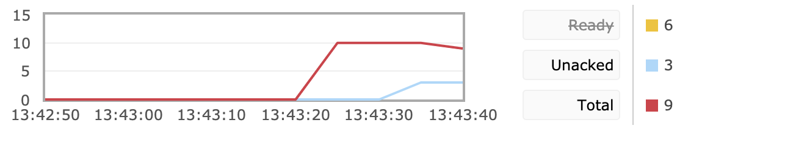
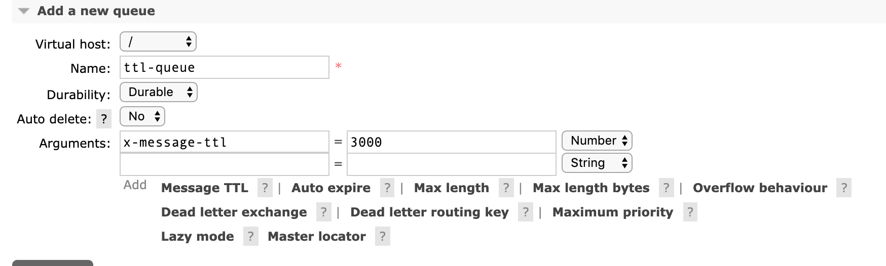

- [消费端限流](#-----)
  * [1. 为什么要对消费端限流](#1-----------)
  * [2.限流的 api 讲解](#2----api---)
  * [3.如何对消费端进行限流](#3----------)
- [TTL](#ttl)
  * [1.消息的 TTL](#1----ttl)
  * [2.队列的 TTL](#2----ttl)
- [死信队列](#----)
  * [实现死信队列步骤](#--------)
  * [总结](#--)
-----

## 消费端限流

### 1. 为什么要对消费端限流

假设一个场景，首先，我们 Rabbitmq 服务器积压了有上万条未处理的消息，我们随便打开一个消费者客户端，会出现这样情况: 巨量的消息瞬间全部推送过来，但是我们单个客户端无法同时处理这么多数据!

当数据量特别大的时候，我们对生产端限流肯定是不科学的，因为有时候并发量就是特别大，有时候并发量又特别少，我们无法约束生产端，这是用户的行为。所以我们应该对消费端限流，用于保持消费端的稳定，当消息数量激增的时候很有可能造成资源耗尽，以及影响服务的性能，导致系统的卡顿甚至直接崩溃。


### 2.限流的 api 讲解

RabbitMQ 提供了一种 qos （服务质量保证）功能，即在非自动确认消息的前提下，如果一定数目的消息（通过基于 consume 或者 channel 设置 Qos 的值）未被确认前，不进行消费新的消息。

```java
/**
* Request specific "quality of service" settings.
* These settings impose limits on the amount of data the server
* will deliver to consumers before requiring acknowledgements.
* Thus they provide a means of consumer-initiated flow control.
* @param prefetchSize maximum amount of content (measured in
* octets) that the server will deliver, 0 if unlimited
* @param prefetchCount maximum number of messages that the server
* will deliver, 0 if unlimited
* @param global true if the settings should be applied to the
* entire channel rather than each consumer
* @throws java.io.IOException if an error is encountered
*/
void basicQos(int prefetchSize, int prefetchCount, boolean global) throws IOException;
```

+ prefetchSize：0，单条消息大小限制，0代表不限制

+ prefetchCount：一次性消费的消息数量。会告诉 RabbitMQ 不要同时给一个消费者推送多于 N 个消息，即一旦有 N 个消息还没有 ack，则该 consumer 将 block 掉，直到有消息 ack。

+ global：true、false 是否将上面设置应用于 channel，简单点说，就是上面限制是 channel 级别的还是 consumer 级别。当我们设置为 false 的时候生效，设置为 true 的时候没有了限流功能，因为 channel 级别尚未实现。
+ 注意：prefetchSize 和 global 这两项，rabbitmq 没有实现，暂且不研究。特别注意一点，prefetchCount 在 no_ask=false 的情况下才生效，即在自动应答的情况下这两个值是不生效的。


### 3.如何对消费端进行限流

+ 首先第一步，我们既然要使用消费端限流，我们需要关闭自动 ack，将 autoAck 设置为 false`channel.basicConsume(queueName, false, consumer);`

+ 第二步我们来设置具体的限流大小以及数量。`channel.basicQos(0, 15, false);`

+ 第三步在消费者的 handleDelivery 消费方法中手动 ack，并且设置批量处理 ack 回应为 true`channel.basicAck(envelope.getDeliveryTag(), true);`


这是生产端代码，与前几章的生产端代码没有做任何改变，主要的操作集中在消费端。

```java
import com.rabbitmq.client.Channel;
import com.rabbitmq.client.Connection;
import com.rabbitmq.client.ConnectionFactory;

public class QosProducer {
    public static void main(String[] args) throws Exception {
        //1. 创建一个 ConnectionFactory 并进行设置
        ConnectionFactory factory = new ConnectionFactory();
        factory.setHost("localhost");
        factory.setVirtualHost("/");
        factory.setUsername("guest");
        factory.setPassword("guest");

        //2. 通过连接工厂来创建连接
        Connection connection = factory.newConnection();

        //3. 通过 Connection 来创建 Channel
        Channel channel = connection.createChannel();

        //4. 声明
        String exchangeName = "test_qos_exchange";
        String routingKey = "item.add";

        //5. 发送
        String msg = "this is qos msg";
        for (int i = 0; i < 10; i++) {
            String tem = msg + " : " + i;
            channel.basicPublish(exchangeName, routingKey, null, tem.getBytes());
            System.out.println("Send message : " + tem);
        }

        //6. 关闭连接
        channel.close();
        connection.close();
    }


}
```

这里我们创建一个消费者，通过以下代码来验证限流效果以及 `global` 参数设置为 `true` 时不起作用.。我们通过`Thread.sleep(5000);` 来让 ack 即处理消息的过程慢一些，这样我们就可以从后台管理工具中清晰观察到限流情况。

```java
import com.rabbitmq.client.*;
import java.io.IOException;
public class QosConsumer {
    public static void main(String[] args) throws Exception {
        //1. 创建一个 ConnectionFactory 并进行设置
        ConnectionFactory factory = new ConnectionFactory();
        factory.setHost("localhost");
        factory.setVirtualHost("/");
        factory.setUsername("guest");
        factory.setPassword("guest");
        factory.setAutomaticRecoveryEnabled(true);
        factory.setNetworkRecoveryInterval(3000);

        //2. 通过连接工厂来创建连接
        Connection connection = factory.newConnection();

        //3. 通过 Connection 来创建 Channel
        final Channel channel = connection.createChannel();

        //4. 声明
        String exchangeName = "test_qos_exchange";
        String queueName = "test_qos_queue";
        String routingKey = "item.#";
        channel.exchangeDeclare(exchangeName, "topic", true, false, null);
        channel.queueDeclare(queueName, true, false, false, null);

        channel.basicQos(0, 3, false);

        //一般不用代码绑定，在管理界面手动绑定
        channel.queueBind(queueName, exchangeName, routingKey);

        //5. 创建消费者并接收消息
        Consumer consumer = new DefaultConsumer(channel) {
            @Override
            public void handleDelivery(String consumerTag, Envelope envelope,
                                       AMQP.BasicProperties properties, byte[] body)
                    throws IOException {
                try {
                    Thread.sleep(5000);
                } catch (InterruptedException e) {
                    e.printStackTrace();
                }
                String message = new String(body, "UTF-8");
                System.out.println("[x] Received '" + message + "'");

                channel.basicAck(envelope.getDeliveryTag(), true);
            }
        };
        //6. 设置 Channel 消费者绑定队列
        channel.basicConsume(queueName, false, consumer);
        channel.basicConsume(queueName, false, consumer1);
    }
}

```

我们从下图中发现 `Unacked`值一直都是 3 ，每过 5 秒 消费一条消息即 Ready 和 Total 都减少 3，而 `Unacked`的值在这里代表消费者正在处理的消息，通过我们的实验发现了消费者一次性最多处理 3 条消息，达到了消费者限流的预期功能。



当我们将`void basicQos(int prefetchSize, int prefetchCount, boolean global)`中的 global 设置为 `true`的时候我们发现并没有了限流的作用。

## TTL

TTL是Time To Live的缩写，也就是生存时间。RabbitMQ支持消息的过期时间，在消息发送时可以进行指定。
RabbitMQ支持队列的过期时间，从消息入队列开始计算，只要超过了队列的超时时间配置，那么消息会自动的清除。

这与 Redis 中的过期时间概念类似。我们应该合理使用 TTL 技术，可以有效的处理过期垃圾消息，从而降低服务器的负载，最大化的发挥服务器的性能。

> RabbitMQ allows you to set TTL (time to live) for both messages and queues. This can be done using optional queue arguments or policies (the latter option is recommended). Message TTL can be enforced for a single queue, a group of queues or applied for individual messages.
>
> RabbitMQ允许您为消息和队列设置TTL（生存时间）。 这可以使用可选的队列参数或策略来完成（建议使用后一个选项）。 可以对单个队列，一组队列强制执行消息TTL，也可以为单个消息应用消息TTL。
>
> ​																																——摘自 RabbitMQ 官方文档


### 1.消息的 TTL

我们在生产端发送消息的时候可以在 properties 中指定 `expiration`属性来对消息过期时间进行设置，单位为毫秒(ms)。

```java
				/**
         * deliverMode 设置为 2 的时候代表持久化消息
         * expiration 意思是设置消息的有效期，超过10秒没有被消费者接收后会被自动删除
         * headers 自定义的一些属性
         * */
        //5. 发送
        Map<String, Object> headers = new HashMap<String, Object>();
        headers.put("myhead1", "111");
        headers.put("myhead2", "222");

        AMQP.BasicProperties properties = new AMQP.BasicProperties().builder()
                .deliveryMode(2)
                .contentEncoding("UTF-8")
                .expiration("100000")
                .headers(headers)
                .build();
        String msg = "test message";
        channel.basicPublish("", queueName, properties, msg.getBytes());
```

我们也可以后台管理页面中进入 Exchange 发送消息指定`expiration`


### 2.队列的 TTL

我们也可以在后台管理界面中新增一个 queue，创建时可以设置 ttl，对于队列中超过该时间的消息将会被移除。




## 死信队列

死信队列：没有被及时消费的消息存放的队列

消息没有被及时消费的原因：

+ **a.消息被拒绝（basic.reject/ basic.nack）并且不再重新投递 requeue=false**

+ **b.TTL(time-to-live) 消息超时未消费**

+ **c.达到最大队列长度**


### 实现死信队列步骤

+ 首先需要设置死信队列的 exchange 和 queue，然后进行绑定:

  ```
  Exchange: dlx.exchange
  Queue: dlx.queue
  RoutingKey: # 代表接收所有路由 key
  ```

+ 然后我们进行正常声明交换机、队列、绑定，只不过我们需要在普通队列加上一个参数即可: `arguments.put("x-dead-letter-exchange",' dlx.exchange' )`
+ 这样消息在过期、requeue失败、 队列在达到最大长度时，消息就可以直接路由到死信队列!


```java
import com.rabbitmq.client.AMQP;
import com.rabbitmq.client.Channel;
import com.rabbitmq.client.Connection;
import com.rabbitmq.client.ConnectionFactory;
public class DlxProducer {
    public static void main(String[] args) throws Exception {
				//设置连接以及创建 channel 湖绿
        String exchangeName = "test_dlx_exchange";
        String routingKey = "item.update";
      
        String msg = "this is dlx msg";

        //我们设置消息过期时间，10秒后再消费 让消息进入死信队列
        AMQP.BasicProperties properties = new AMQP.BasicProperties().builder()
                .deliveryMode(2)
                .expiration("10000")
                .build();

        channel.basicPublish(exchangeName, routingKey, true, properties, msg.getBytes());
        System.out.println("Send message : " + msg);

        channel.close();
        connection.close();
    }
}

```


```java
import com.rabbitmq.client.*;
import java.io.IOException;
import java.util.HashMap;
import java.util.Map;

public class DlxConsumer {
    public static void main(String[] args) throws Exception {
				//创建连接、创建channel忽略 内容可以在上面代码中获取
        String exchangeName = "test_dlx_exchange";
        String queueName = "test_dlx_queue";
        String routingKey = "item.#";

        //必须设置参数到 arguments 中
        Map<String, Object> arguments = new HashMap<String, Object>();
        arguments.put("x-dead-letter-exchange", "dlx.exchange");

        channel.exchangeDeclare(exchangeName, "topic", true, false, null);
        //将 arguments 放入队列的声明中
        channel.queueDeclare(queueName, true, false, false, arguments);

        //一般不用代码绑定，在管理界面手动绑定
        channel.queueBind(queueName, exchangeName, routingKey);


        //声明死信队列
        channel.exchangeDeclare("dlx.exchange", "topic", true, false, null);
        channel.queueDeclare("dlx.queue", true, false, false, null);
        //路由键为 # 代表可以路由到所有消息
        channel.queueBind("dlx.queue", "dlx.exchange", "#");

        Consumer consumer = new DefaultConsumer(channel) {
            @Override
            public void handleDelivery(String consumerTag, Envelope envelope,
                                       AMQP.BasicProperties properties, byte[] body)
                    throws IOException {

                String message = new String(body, "UTF-8");
                System.out.println(" [x] Received '" + message + "'");

            }
        };

        //6. 设置 Channel 消费者绑定队列
        channel.basicConsume(queueName, true, consumer);
    }
}

```

### 总结

DLX也是一个正常的 Exchange，和一般的 Exchange 没有区别，它能在任何的队列上被指定，实际上就是设置某个队列的属性。当这个队列中有死信时，RabbitMQ 就会自动的将这个消息重新发布到设置的 Exchange 上去，进而被路由到另一个队列。可以监听这个队列中消息做相应的处理。