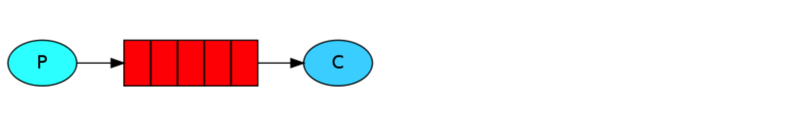
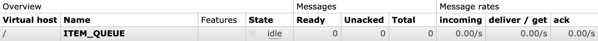

- [RabbitMQ 简述](#rabbitmq---)
- [简单队列](#----)
- [java 方式](#java---)
  * [生产者](#---)
  * [消费者](#---)
- [总结](#--)
- [spring-amqp方式](#spring-amqp--)
-----


## RabbitMQ 简述

RabbitMQ是使用Erlang语言开发的开源消息队列系统，基于AMQP协议来实现。AMQP的主要特征是面向消息、队列、路由(包括点对点和发布/订阅)、可靠性、 安全。AMQP协议更多用在企业系统内，对数据一致性、稳定性和可靠性要求很高的场景，对性能和吞吐量的要求还在其次。

RabbitMQ是一个消息代理：它接受并转发消息。 您可以将其视为邮局：当您将要把寄发的邮件投递到邮箱中时，您可以确信Postman 先生最终会将邮件发送给收件人。 在这个比喻中，RabbitMQ是一个邮箱，邮局和邮递员，用来接受，存储和转发二进制数据块的消息。

队列就像是在RabbitMQ中扮演邮箱的角色。 虽然消息经过RabbitMQ和应用程序，但它们只能存储在队列中。 队列只受主机的内存和磁盘限制的限制，它本质上是一个大的消息缓冲区。 许多生产者可以发送到一个队列的消息，许多消费者可以尝试从一个队列接收数据。

producer即为生产者，用来产生消息发送给队列。consumer是消费者，需要去读队列内的消息。producer，consumer和broker(rabbitMQ server)不必驻留在同一个主机上;确实在大多数应用程序中它们是这样分布的。

## 简单队列

简单队列是最简单的一种模式，由生产者、队列、消费者组成。生产者将消息发送给队列，消费者从队列中读取消息完成消费。

在下图中，“P”是我们的生产者，“C”是我们的消费者。 中间的框是队列 - RabbitMQ代表消费者的消息缓冲区。



## java 方式

### 生产者

```java
package com.anqi.mq.nat;

import com.rabbitmq.client.Channel;
import com.rabbitmq.client.Connection;
import com.rabbitmq.client.ConnectionFactory;

public class MyProducer {
    private static final String QUEUE_NAME = "ITEM_QUEUE";

    public static void main(String[] args) throws Exception {
        //1. 创建一个 ConnectionFactory 并进行设置
        ConnectionFactory factory = new ConnectionFactory();
        factory.setHost("localhost");
        factory.setVirtualHost("/");
        factory.setUsername("guest");
        factory.setPassword("guest");

        //2. 通过连接工厂来创建连接
        Connection connection = factory.newConnection();

        //3. 通过 Connection 来创建 Channel
        Channel channel = connection.createChannel();

        //实际场景中，消息多为json格式的对象
        String msg = "hello";
        //4. 发送三条数据
        for (int i = 1; i <= 3 ; i++) {
            channel.basicPublish("", QUEUE_NAME, null, msg.getBytes());
            System.out.println("Send message" + i +" : " + msg);
        }

        //5. 关闭连接
        channel.close();
        connection.close();
    }
}
```

```java
    /**
     * Declare a queue
     * @param queue the name of the queue
     * @param durable true if we are declaring a durable queue (the queue will survive a server restart)
     * @param exclusive true if we are declaring an exclusive queue (restricted to this connection)
     * @param autoDelete true if we are declaring an autodelete queue (server will delete it when no longer in use)
     * @param arguments other properties (construction arguments) for the queue
     * @return a declaration-confirm method to indicate the queue was successfully declared
     * @throws java.io.IOException if an error is encountered
     */
    Queue.DeclareOk queueDeclare(String queue, boolean durable, boolean exclusive, boolean autoDelete,Map<String, Object> arguments) throws IOException;

    /**
     * Publish a message
     * @see com.rabbitmq.client.AMQP.Basic.Publish
     * @param exchange the exchange to publish the message to
     * @param routingKey the routing key
     * @param props other properties for the message - routing headers etc
     * @param body the message body
     * @throws java.io.IOException if an error is encountered
     */
    void basicPublish(String exchange, String routingKey, BasicProperties props, byte[] body) throws IOException;


    /**
     * Start a non-nolocal, non-exclusive consumer, with
     * a server-generated consumerTag.
     * @param queue the name of the queue
     * @param autoAck true if the server should consider messages
     * acknowledged once delivered; false if the server should expect
     * explicit acknowledgements
     * @param callback an interface to the consumer object
     * @return the consumerTag generated by the server
     * @throws java.io.IOException if an error is encountered
     * @see com.rabbitmq.client.AMQP.Basic.Consume
     * @see com.rabbitmq.client.AMQP.Basic.ConsumeOk
     * @see #basicConsume(String, boolean, String, boolean, boolean, Map, Consumer)
     */
    String basicConsume(String queue, boolean autoAck, Consumer callback) throws IOException;


```

### 消费者

```java
package com.anqi.mq.nat;

import com.rabbitmq.client.*;
import java.io.IOException;

public class MyConsumer {

    private static final String QUEUE_NAME = "ITEM_QUEUE";

    public static void main(String[] args) throws Exception {
        //1. 创建一个 ConnectionFactory 并进行设置
        ConnectionFactory factory = new ConnectionFactory();
        factory.setHost("localhost");
        factory.setVirtualHost("/");
        factory.setUsername("guest");
        factory.setPassword("guest");

        //2. 通过连接工厂来创建连接
        Connection connection = factory.newConnection();

        //3. 通过 Connection 来创建 Channel
        Channel channel = connection.createChannel();

        //4. 声明一个队列
        channel.queueDeclare(QUEUE_NAME, true, false, false, null);
        System.out.println(" [*] Waiting for messages. To exit press CTRL+C");

        /*
           true:表示自动确认，只要消息从队列中获取，无论消费者获取到消息后是否成功消费，都会认为消息已经成功消费
           false:表示手动确认，消费者获取消息后，服务器会将该消息标记为不可用状态，等待消费者的反馈，如果消费者一
           直没有反馈，那么该消息将一直处于不可用状态，并且服务器会认为该消费者已经挂掉，不会再给其发送消息，
           直到该消费者反馈。
        */

        //5. 创建消费者并接收消息
        Consumer consumer = new DefaultConsumer(channel) {
            @Override
            public void handleDelivery(String consumerTag, Envelope envelope,
                                       AMQP.BasicProperties properties, byte[] body)
                    throws IOException {
                String message = new String(body, "UTF-8");
                System.out.println(" [x] Received '" + message + "'");
            }
        };

        //6. 设置 Channel 消费者绑定队列
        channel.basicConsume(QUEUE_NAME, true, consumer);

    }
}
```

```
Send message : hello

 [*] Waiting for messages. To exit press CTRL+C
 [x] Received 'hello'
```

当我们启动生产者之后查看RabbitMQ管理后台可以看到有一条消息正在等待被消费。


当我们启动消费者之后再次查看，可以看到积压的一条消息已经被消费。




## 总结

- 队列声明queueDeclare的参数：第一个参数表示队列名称、第二个参数为是否持久化（true表示是，队列将在服务器重启时生存）、第三个参数为是否是独占队列（创建者可以使用的私有队列，断开后自动删除）、第四个参数为当所有消费者客户端连接断开时是否自动删除队列、第五个参数为队列的其他参数。

- basicConsume的第二个参数autoAck: 应答模式，true：自动应答，即消费者获取到消息，该消息就会从队列中删除掉，false：手动应答，当从队列中取出消息后，需要程序员手动调用方法应答，如果没有应答，该消息还会再放进队列中，就会出现该消息一直没有被消费掉的现象。

- 这种简单队列的模式，系统会为每个队列隐式地绑定一个默认交换机，交换机名称为" (AMQP default)"，类型为直连 direct，当你手动创建一个队列时，系统会自动将这个队列绑定到一个名称为空的 Direct 类型的交换机上，绑定的路由键 routing key 与队列名称相同，相当于 `channel.queueBind(queue:"QUEUE_NAME", exchange:"(AMQP default)“, routingKey:"QUEUE_NAME");`虽然实例没有显式声明交换机，但是当路由键和队列名称一样时，就会将消息发送到这个默认的交换机中。这种方式比较简单，但是无法满足复杂的业务需求，所以通常在生产环境中很少使用这种方式。

- >The default exchange is implicitly bound to every queue, with a routing key equal to the queue name. It is not possible to explicitly bind to, or unbind from the default exchange. It also cannot be deleted.默认交换机隐式绑定到每个队列，其中路由键等于队列名称。不可能显式绑定到，或从缺省交换中解除绑定。它也不能被删除。
  >
  >​                                                                                                         ——引自 RabbitMQ 官方文档

  ​																							

## spring-amqp方式

引入 Maven 依赖

```xml
        <dependency>
            <groupId>com.rabbitmq</groupId>
            <artifactId>amqp-client</artifactId>
            <version>5.6.0</version>
        </dependency>        
				<dependency>
            <groupId>org.springframework.amqp</groupId>
            <artifactId>spring-rabbit</artifactId>
            <version>2.1.5.RELEASE</version>
        </dependency>
```

spring 配置文件

```xml
<beans xmlns="http://www.springframework.org/schema/beans"
       xmlns:xsi="http://www.w3.org/2001/XMLSchema-instance"
       xmlns:rabbit="http://www.springframework.org/schema/rabbit"
       xsi:schemaLocation="http://www.springframework.org/schema/rabbit
           https://www.springframework.org/schema/rabbit/spring-rabbit.xsd
           http://www.springframework.org/schema/beans
           https://www.springframework.org/schema/beans/spring-beans.xsd">

    <rabbit:connection-factory id="connectionFactory" host="localhost" virtual-host="/"
    username="guest" password="guest"/>
    <rabbit:template id="amqpTemplate" connection-factory="connectionFactory"/>
    <rabbit:admin connection-factory="connectionFactory"/>
    <rabbit:queue name="MY-QUEUE"/>
</beans>

```

使用测试

```java
import org.springframework.amqp.core.AmqpTemplate;
import org.springframework.context.ApplicationContext;
import org.springframework.context.support.ClassPathXmlApplicationContext;

public class Main {
    public static void main(String[] args) {
        ApplicationContext app = new ClassPathXmlApplicationContext("spring/rabbit-context.xml");
        AmqpTemplate amqpTemplate = app.getBean(AmqpTemplate.class);
        amqpTemplate.convertAndSend("MY-QUEUE", "Item");
        String msg = (String) amqpTemplate.receiveAndConvert("MY-QUEUE");
        System.out.println(msg);
    }
}
```

参考方法

```java
/**
 * Convert a Java object to an Amqp {@link Message} and send it to a specific exchange
 * with a specific routing key.
 *
 * @param exchange the name of the exchange
 * @param routingKey the routing key
 * @param message a message to send
 * @throws AmqpException if there is a problem
 */
void convertAndSend(String exchange, String routingKey, Object message) throws AmqpException;
/**
	 * Receive a message if there is one from a specific queue and convert it to a Java
	 * object. Returns immediately, possibly with a null value.
	 *
	 * @param queueName the name of the queue to poll
	 * @return a message or null if there is none waiting
	 * @throws AmqpException if there is a problem
	 */
@Nullable
Object receiveAndConvert(String queueName) throws AmqpException;
```
